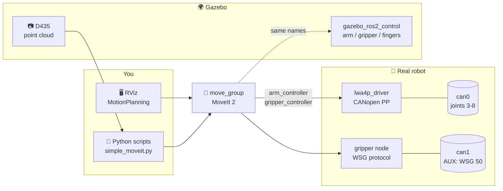

<div align="center">

# 🦾 Schunk LWA 4P · ROS 2 Humble

**CANopen driver, MoveIt 2, WSG 50 gripper and a Gazebo simulation with RGB-D bin picking**

[](https://docs.ros.org/en/humble/)
[](https://releases.ubuntu.com/22.04/)
[](https://moveit.ros.org/)
[](https://classic.gazebosim.org/)
[](https://www.python.org/)
[](https://www.can-cia.org/)
[](LICENSE)

</div>

---

## ✨ Features

| | |
|---|---|
| 🔌 **Real-robot driver** | Python CANopen (CiA 402) driver for the 6 ERB modules over SocketCAN. Publishes `/joint_states` and serves a `FollowJointTrajectory` action |
| ✋ **WSG 50 gripper** | Weiss/Schunk WSG 50-110 on the AUX CAN, with a `GripperCommand` action and force-controlled grasping |
| 🧭 **MoveIt 2** | Plan and execute from RViz or from Python; named poses `home`, `work1`, `work2`, `open`, `closed` |
| 🌍 **Gazebo simulation** | Same controller names as the real arm, PID-driven joints and working friction grasps |
| 📷 **RealSense D435 (simulated)** | RGB, aligned depth and a colored point cloud on RealSense-style topics |
| 📦 **Bin picking demo** | Point-cloud object detection, grasp planning with wall clearance, Cartesian approach and attached objects |
| 🐍 **Simple Python API** | `named()`, `pose()`, `line()`, `gripper()`, `add_box()`, `attach_box()` |

## 🗺️ How it fits together



## 📁 Repository layout

```
lwa4p_ws/                     ← this repo = a colcon workspace
├── 80-can.rules              udev rule: can0/can1 up at 500 kbit/s automatically
└── src/
    ├── lwa4p_description/    URDF/xacro: arm, WSG 50, RealSense D435, meshes
    ├── lwa4p_driver/         CANopen arm driver, WSG 50 gripper node, CLI tools
    ├── lwa4p_moveit_config/  MoveIt 2 config (Setup Assistant) + real.launch.py
    └── lwa4p_gazebo/         Gazebo world, launch, controllers, example scripts
isaac/                        Isaac Sim / Isaac Lab model for VLA & RL training (see isaac/README.md)
```

---

## 🚀 Setup

### 1️⃣ Install dependencies

<details open>
<summary><b>ROS 2 Humble + MoveIt + Gazebo</b></summary>

Install [ROS 2 Humble desktop](https://docs.ros.org/en/humble/Installation/Ubuntu-Install-Debs.html) first, then:

```bash
sudo apt install \
  ros-humble-moveit ros-humble-xacro \
  ros-humble-gazebo-ros-pkgs ros-humble-gazebo-ros2-control \
  ros-humble-joint-state-broadcaster ros-humble-joint-trajectory-controller \
  ros-humble-forward-command-controller \
  python3-colcon-common-extensions python3-rosdep
```
</details>

<details>
<summary><b>Real robot only: CAN tools and Python CANopen</b></summary>

```bash
sudo apt install can-utils
pip install canopen python-can
```
</details>

<details>
<summary><b>Optional: mock-hardware demo without physics</b></summary>

```bash
sudo apt install ros-humble-gripper-controllers
```
</details>

### 2️⃣ Clone and build

```bash
git clone git@github.com:Tomas-Jurov/lwa4p_driver.git ~/lwa4p_ws
cd ~/lwa4p_ws
source /opt/ros/humble/setup.bash
rosdep install --from-paths src --ignore-src -y     # any missing ROS packages
colcon build --symlink-install
```

> [!TIP]
> With `--symlink-install`, edits to Python, YAML and launch files take effect immediately. Rebuild only when you **add** new files.

### 3️⃣ Every new terminal

```bash
source /opt/ros/humble/setup.bash
source ~/lwa4p_ws/install/setup.bash
export RMW_IMPLEMENTATION=rmw_fastrtps_cpp
```

> [!IMPORTANT]
> Every terminal that talks to the robot or the simulation must use the **same** RMW. `move_group` hangs on `rmw_zenoh_cpp` in Humble, so use FastDDS.

💡 To make it one word, add this to `~/.bashrc`:
```bash
alias lwa='source /opt/ros/humble/setup.bash && source ~/lwa4p_ws/install/setup.bash && export RMW_IMPLEMENTATION=rmw_fastrtps_cpp'
```

---

## 🌍 Simulation

```bash
ros2 launch lwa4p_gazebo gazebo.launch.py gui:=false     # RViz only (light)
ros2 launch lwa4p_gazebo gazebo.launch.py                # + Gazebo window
```

Wait for **`You can start planning now!`** and four controllers `activated`. RViz shows the robot, the camera point cloud and the camera image.

The world contains:
- 🧪 a stand with a 15 mm test tube;
- 📦 a bin with four objects, and an empty output bin;
- 📷 a RealSense above the work area.

### 🎮 Try it

| | Command |
|---|---|
| 🏠 Named pose | `ros2 run lwa4p_gazebo go_to.py home` &nbsp;(`work1`, `work2`, `open`, `closed`) |
| 🔢 Joint angles (deg) | `ros2 run lwa4p_gazebo go_to.py --joints 0 30 60 0 90 0` |
| 📍 Gripper position (m, pointing down) | `ros2 run lwa4p_gazebo go_to.py --pose 0.45 0 0.30` |
| ✋ Gripper opening (m) | `ros2 run lwa4p_gazebo go_to.py --gap 0.03` |
| 🧪 Pick and place the test tube | `ros2 run lwa4p_gazebo pick_tube.py` |
| 👀 Bin picking: detect only | `ros2 run lwa4p_gazebo bin_pick.py --look` |
| 📦 Bin picking: empty the bin | `ros2 run lwa4p_gazebo bin_pick.py` |

🔄 **Reset the world:** Ctrl+C the launch and start it again.

### 📷 Camera topics

| Topic | Content |
|---|---|
| `/camera/color/image_raw` | RGB 424 × 240 @ 5 Hz |
| `/camera/depth/image_rect_raw` | depth in metres, aligned to the colour image |
| `/camera/depth/color/points` | `PointCloud2` XYZRGB in `camera_color_optical_frame` |
| `/camera/color/camera_info` | intrinsics |

### 🐍 Your own program

```python
import rclpy
from simple_moveit import SimpleMoveIt   # lwa4p_gazebo/scripts/

rclpy.init()
robot = SimpleMoveIt()
robot.add_box("stand", (0.3, 0.4, 0.16), (0.5, 0.0, 0.02))   # obstacle for MoveIt
robot.named("home")
robot.gripper(0.085)                 # open (fingertip gap in metres)
robot.pose(0.45, 0.0, 0.29)          # above the tube, gripper pointing down
robot.line(0.45, 0.0, 0.17)          # straight down
robot.gripper(0.013)                 # squeeze the 15 mm tube
robot.line(0.45, 0.0, 0.29)          # straight up
```

📖 More details are in [`src/lwa4p_gazebo/README.md`](src/lwa4p_gazebo/README.md).

---

## 🔩 Real robot

> [!WARNING]
> Someone must stand at the **E-stop** for every motion. Never run two programs on the same CAN bus at the same time.

### One-time: CAN interfaces

PEAK PCAN-USB Pro channels:

| Linux interface | PCAN channel | Connected to |
|---|---|---|
| `can0` | CAN1 | arm joints (CANopen nodes 3–8) |
| `can1` | CAN2 | AUX CAN, WSG 50 |

```bash
sudo cp 80-can.rules /etc/udev/rules.d/ && sudo udevadm control --reload
# replug the PCAN adapter, then check:
ip -br link | grep can        # can0 / can1 should be UP
```

### ▶️ Run

```bash
# terminal 1: driver + gripper + MoveIt + RViz (drives start DISABLED)
ros2 launch lwa4p_moveit_config real.launch.py

# terminal 2
ros2 service call /lwa4p_driver/enable std_srvs/srv/Trigger   # each joint: small ±0.5° check, then holds
ros2 run lwa4p_driver gripper_cmd home                        # once after power-up
```

Then plan and execute in RViz, or run your `simple_moveit.py` scripts. They use the same MoveIt interface as in the simulation.

| | Command |
|---|---|
| 🔁 Move one joint out and back | `ros2 run lwa4p_driver test_move --joint 6 --deg 10 --time 5` |
| ✊ Grasp a 15 mm part (35 N) | `ros2 run lwa4p_driver gripper_cmd grip 15 --force 35` |
| ✋ Open / gripper state | `ros2 run lwa4p_driver gripper_cmd open` · `... state` |
| 🧯 Reset faults | `ros2 service call /lwa4p_driver/reset std_srvs/srv/Trigger` |
| 🛑 Disable (brakes close) | `ros2 service call /lwa4p_driver/disable std_srvs/srv/Trigger` |

<details>
<summary><b>⚙️ Limits and hardware notes</b></summary>

- The motor supply limits the arm to about **0.5 rad/s** and **0.4 rad/s²**. Faster or harder moves trip a DC-link undervoltage fault (`0x3222`). Limits are in `lwa4p_moveit_config/config/joint_limits.yaml` and `lwa4p_driver/config/driver.yaml`.
- After a motor-power drop, the ERB modules redo their commutation on the first motion. The driver's `enable` handles this with a small single move per joint.
- Units on the bus are milli-degrees. Only Profile Position mode is used, always with absolute targets.
- WSG 50: home it after every power-up. Grasp at 80 mm/s, because slower grasps report false "blocked". The finger offset is in `lwa4p_driver/config/gripper.yaml`.
- Drive positions are logged to `~/.ros/lwa4p_trace_*.csv` for every trajectory, with a per-joint report on abort.

</details>

---

## 🧠 Isaac Sim / VLA training

[`isaac/`](isaac/README.md) contains a plain URDF with **SCHUNK datasheet masses**, mesh-based inertias, real torque and speed limits, and a two-finger WSG 50. It also has an Isaac Lab `ArticulationCfg` template, the camera intrinsics, the reference scene, and the action/observation contract with the real robot.

---

## 🩺 Troubleshooting

| Symptom | Fix |
|---|---|
| ⏳ `waiting for move_group ...` forever | That terminal uses another RMW: `export RMW_IMPLEMENTATION=rmw_fastrtps_cpp` |
| 📷 `no point cloud` | The laptop is overloaded: use `gui:=false` and close the browser |
| ❌ `INVALID_MOTION_PLAN` / `NO_IK_SOLUTION` | The target is out of reach (about 0.55 m from the base at table height, pointing down) or blocked by an obstacle |
| 🔌 `can0 is missing or DOWN` | Replug the PCAN adapter, check the udev rule, or run `sudo ip link set can0 up type can bitrate 500000` |
| ⚡ Joints fault with `0x3222` | Motor supply too weak for the move: slow down, then reset and enable |

---

## 📜 License

The code is under the [MIT License](LICENSE).

The arm meshes and kinematic parameters in `lwa4p_description` come from [ipa320/schunk_modular_robotics](https://github.com/ipa320/schunk_modular_robotics) and keep their original **LGPL-3.0** license.

<div align="center">

Made with ☕ and 🤖 · [Tomas Jurov](https://github.com/Tomas-Jurov)

</div>
